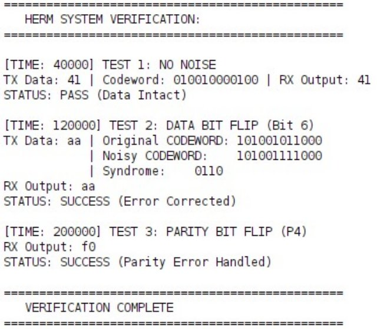
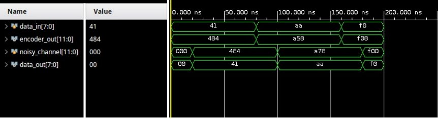

# HERM — Hamming Enhanced RISC Module

> A hardware-only Single Event Upset (SEU) correction bridge between a microcontroller and RF module, implementing **Hamming(12,8)** encoding and decoding entirely in Verilog — no software-based error correction required.

📄 **Published in:** *Research Forum Proceedings, 1st Edition — IEEE Student Branch JIIT*, January 30 – February 2, 2025, JIIT Noida.

---

## Table of Contents

- [Overview](#overview)
- [Motivation](#motivation)
- [Hamming(12,8) Theory](#hamming128-theory)
- [Architecture](#architecture)
- [Codeword Structure](#codeword-structure)
- [Repository Structure](#repository-structure)
- [Simulation](#simulation)
- [Test Cases & Results](#test-cases--results)
- [Key Design Decisions](#key-design-decisions)
- [Publication](#publication)
- [Future Work](#future-work)
- [Authors](#authors)

---

## Overview

HERM is a **dedicated hardware error-correction bridge** that sits between a microcontroller and an RF communication module. It encodes outgoing 8-bit data into a 12-bit Hamming codeword before transmission and decodes incoming codewords — detecting and correcting any single-bit corruption — before passing clean data to the microcontroller.

The entire encoder-decoder pipeline is implemented in **synthesizable Verilog**, making it deployable directly on an FPGA or as part of an ASIC flow. No firmware, no interrupts, no software overhead.

---

## Motivation

In real-world communication environments — especially in space, industrial, or RF-noisy contexts — transmitted bits can be flipped due to electromagnetic interference, cosmic radiation, or signal degradation. These are called **Single Event Upsets (SEUs)**.

Conventional systems handle this in firmware: the microcontroller receives corrupted data, runs a software routine to detect and fix errors, and retransmits if needed. This introduces:

- Latency (software execution cycles)
- Firmware complexity
- MCU overhead during high-throughput communication

**HERM eliminates all of that.** Error correction happens at the hardware level, in a single propagation delay, before data ever reaches the MCU. While optimized software implementations achieve approximately 45–50 cycles, HERM performs the same correction combinationally — in a single clock cycle.

---

## Hamming(12,8) Theory

Hamming codes work by inserting **parity bits** at power-of-2 positions in the codeword. Each parity bit covers a specific subset of data bit positions.

For a **Hamming(12,8)** code:
- **8 data bits** → encoded into a **12-bit codeword**
- **4 parity bits**: P1, P2, P4, P8 (placed at positions 1, 2, 4, 8)
- Can **detect and correct any single-bit error**

### Parity bit coverage

| Parity Bit | Covers Positions (1-indexed)     | Data bits covered         |
|------------|----------------------------------|---------------------------|
| P1 (pos 1) | 1, 3, 5, 7, 9, 11               | d0, d1, d3, d4, d6        |
| P2 (pos 2) | 2, 3, 6, 7, 10, 11              | d0, d2, d3, d5, d6        |
| P4 (pos 4) | 4, 5, 6, 7, 12                  | d1, d2, d3, d7            |
| P8 (pos 8) | 8, 9, 10, 11, 12                | d4, d5, d6, d7            |

### Parity equations (even parity)

```
P1 = D0 ⊕ D1 ⊕ D3 ⊕ D4 ⊕ D6
P2 = D0 ⊕ D2 ⊕ D3 ⊕ D5 ⊕ D6
P4 = D1 ⊕ D2 ⊕ D3 ⊕ D7
P8 = D4 ⊕ D5 ⊕ D6 ⊕ D7
```

### Syndrome decoding

At the receiver, parity is recomputed from received data positions and XORed with the stored parity bits. The resulting **4-bit syndrome** directly gives the 1-indexed position of the erroneous bit:

```
syndrome = 0000  →  No error
syndrome = 0110  →  Error at position 6 → flip codeword[5]
```

---

## Architecture

```
┌──────────────┐     12-bit codeword      ┌──────────────┐
│              │ ──────────────────────►  │              │
│   ENCODER    │                          │   CHANNEL    │  (noisy / SEU)
│  (Hamming    │                          │              │
│   12,8)      │                          └──────┬───────┘
└──────────────┘                                 │
       ▲                                         │ (possibly flipped bits)
       │ 8-bit data_in                           ▼
       │                                 ┌──────────────┐
  Microcontroller ◄─── 8-bit data_out ── │   DECODER    │
                                         │  (Syndrome   │
                                         │   + Correct) │
                                         └──────────────┘
```

---

## Codeword Structure

The 12-bit codeword is laid out as follows (LSB = index 0):

```
Index:  11   10    9    8    7    6    5    4    3    2    1    0
        d7   d6   d5   d4   P8   d3   d2   d1   P4   d0   P2   P1
```

Parity bits occupy indices **0 (P1), 1 (P2), 3 (P4), 7 (P8)**.  
Data bits occupy indices **2, 4, 5, 6, 8, 9, 10, 11**.

---

## Repository Structure

```
HERM/
├── src/
│   ├── encoder.v                          # Hamming(12,8) encoder — 8-bit → 12-bit
│   ├── decoder.v                          # Hamming(12,8) decoder with syndrome correction
│   └── herm_top.v                         # Top-level wrapper with fault-injection channel
├── tb/
│   └── herm_tb.v                          # Self-checking testbench (3 test cases)
├── results/
│   ├── tcl_console_output.png             # Vivado TCL console: all 3 tests PASS
│   └── waveform_vivado.png                # Vivado waveform: encoder/decoder signal trace
├── paper/
│   └── HERM_IEEE_SB_JIIT_ResearchForum_2025.pdf   # Published paper
├── docs/
│   └── hamming_theory.md                  # Extended theory and worked examples
├── .gitignore
└── README.md
```

---

## Simulation

### Using Xilinx Vivado

1. Create a new project targeting your FPGA (e.g., Basys 3 / Artix-7)
2. Add all `.v` files from `src/` as design sources
3. Add `tb/herm_tb.v` as a simulation source
4. Set `herm_tb` as the top-level simulation module
5. Run Behavioral Simulation
6. Observe waveforms and TCL console output

### Using Icarus Verilog (open-source, command line)

```bash
# Compile
iverilog -o herm_sim src/encoder.v src/decoder.v tb/herm_tb.v

# Run
vvp herm_sim
```

---

## Test Cases & Results

All three test cases verify correct operation of the full encoder → channel → decoder pipeline.

| Test | Input Data | Error Injected            | Syndrome | Result  |
|------|------------|---------------------------|----------|---------|
| 1    | `0x41` (A) | None (clean channel)      | `0000`   | ✅ PASS |
| 2    | `0xAA`     | Data bit flip (index 5)   | `0110`   | ✅ PASS |
| 3    | `0xF0`     | Parity flip (P4, index 3) | `0100`   | ✅ PASS |

### TCL Console Output (Xilinx Vivado)



### Waveform (Xilinx Vivado)



The waveform confirms correct signal propagation across all three test vectors — `data_in`, `encoder_out`, `noisy_channel`, and `data_out` all behave as expected under both clean and fault-injected conditions.

---

## Key Design Decisions

### Why hardware-only?
Software error correction adds MCU cycles and firmware complexity. A hardware pipeline corrects errors combinationally — in a single clock cycle — with deterministic, near-zero latency critical for RF communication.

### Why Hamming(12,8) over simpler codes?
- Corrects **any single-bit error** and detects double-bit errors
- 33% overhead (4 parity bits for 8 data bits) is acceptable for typical UART/SPI frame sizes
- The syndrome directly encodes the error position — no lookup table needed

### Syndrome as direct error pointer
The 4-bit syndrome value is the 1-indexed position of the erroneous bit. Correction is a single indexed bit-flip operation (`corrected_codeword[syndrome - 1]`), with no conditional chain or priority encoder required.

### Comparison with prior work
| Approach | Latency | Hardware Overhead | MCU Load |
|----------|---------|-------------------|----------|
| Software ECC (lookup table) | ~45–50 CPU cycles | None | High |
| HARV hardened processor | 1 cycle | Very High (unhardened voters) | None |
| **HERM (this work)** | **1 cycle (combinational)** | **Low** | **None** |

---

## Publication

This work was published in the **Research Forum Proceedings, 1st Edition**  
**IEEE Student Branch JIIT** — Student Conference, January 30 – February 2, 2025, JIIT Noida.

📄 Full paper available in [`paper/HERM_IEEE_SB_JIIT_ResearchForum_2025.pdf`](paper/HERM_IEEE_SB_JIIT_ResearchForum_2025.pdf)

**Authors:** Nayan Tiwari, Rajveer Taneja, Yashaswini Mahanta  
Electronics and Communication Engineering, JIIT Noida

---

## Future Work

- [ ] Extend to **Hamming(16,11)** for wider data paths
- [ ] Add **SECDED** (Single Error Correct, Double Error Detect) using an overall parity bit
- [ ] Integrate with a **UART TX/RX** module for full end-to-end communication demo
- [ ] Synthesize and report **LUT/FF utilization** on Basys 3 (Artix-7)
- [ ] Measure **propagation delay** via Vivado timing analysis
- [ ] Port to **Cadence / ModelSim** for mixed-signal verification

---

## Authors

| Name | Email |
|------|-------|
| **Rajveer Taneja** | rajveertaneja2112@gmail.com |
| Nayan Tiwari | naayan2005@gmail.com |
| Yashaswini Mahanta | mahantayashaswini@gmail.com |

Electronics and Communication Engineering, JIIT Noida  
[GitHub](https://github.com/Rajveer3000) · [LinkedIn](https://www.linkedin.com/in/rajveer-taneja-504123305)
